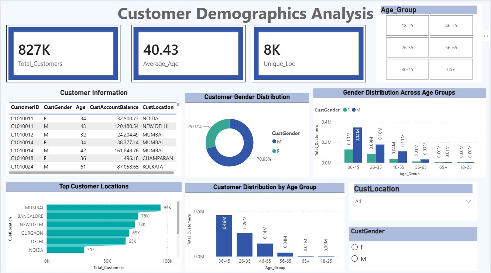
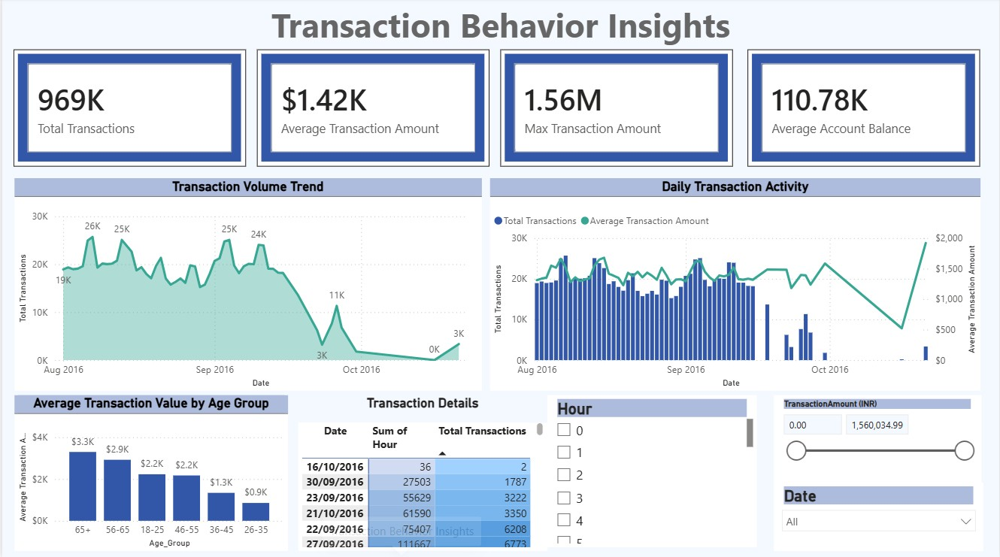
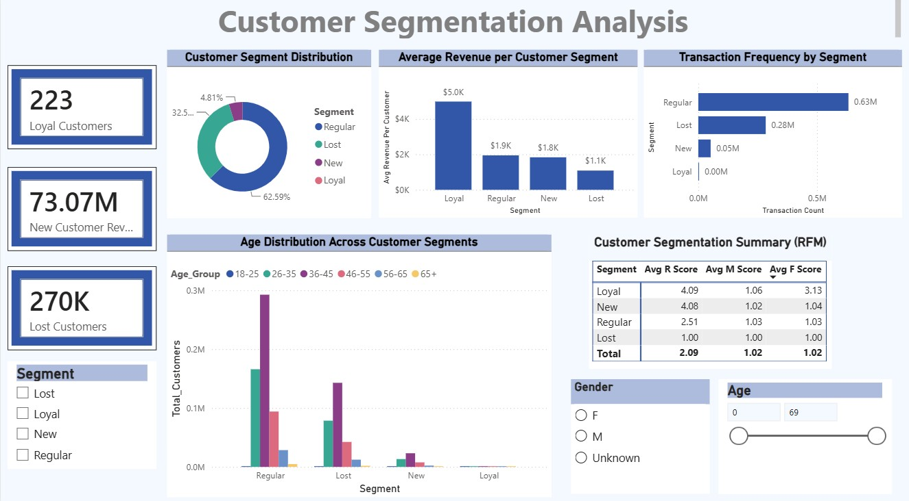
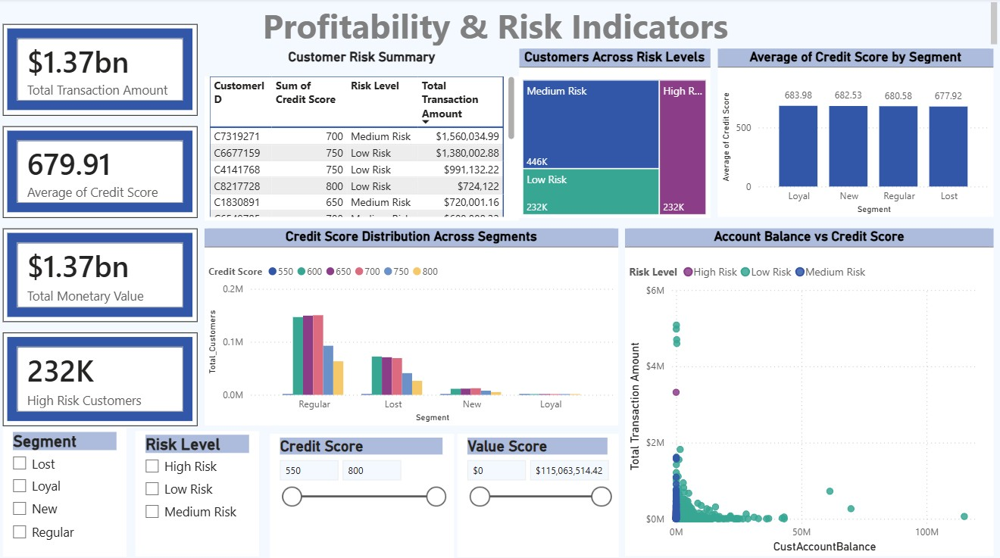

# 🏦 Bank Customer Segmentation & Transaction Analysis Dashboard

## 📌 Overview

This project is an interactive Power BI dashboard developed to analyze banking customer data and transaction patterns. It provides insights into customer demographics, transaction behavior, customer segmentation, and profitability, enabling better business decision making.

## 🎯 Objectives

* Analyze customer demographics.
* Understand transaction behavior and trends.
* Segment customers based on their activity.
* Identify profitable customer groups.
* Monitor key business KPIs through interactive dashboards.

## 📊 Dashboard Features

### Dashboard 1: Customer Demographics

* Total Customers
* Gender Distribution
* Age Group Analysis
* Occupation Distribution
* Customer Distribution by Location

### Dashboard 2: Transaction Behavior

* Total Transactions
* Total Revenue
* Average Transaction Amount
* Average Account Balance
* Transaction Trends Over Time
* Transaction Distribution

### Dashboard 3: Customer Segmentation

* Customer Segments (New, Regular, Loyal, Lost)
* Revenue by Segment
* Transaction Frequency by Segment
* Customer Lifetime Value
* Segment Wise Performance

### Dashboard 4: Profitability & Risk Analysis

* High Value Customers
* Revenue Contribution
* Profitability Analysis
* Customer Risk Indicators
* Account Balance Analysis

## 🛠️ Tools & Technologies

* Power BI
* Power Query
* DAX
* Data Modeling
* Microsoft Excel

## 📈 Key KPIs

* Total Customers
* Total Transactions
* Total Revenue
* Average Transaction Amount
* Average Account Balance
* Customer Lifetime Value
* Revenue by Segment

## 📁 Project Structure

```
├── proj.pbit
├── bank_transactions.zip
  └── bank_transactions.csv
├── README.md
└── Screenshots/
```

## 🚀 Key Skills Demonstrated

* Data Cleaning
* Data Transformation
* Data Modeling
* DAX Calculations
* Business Intelligence
* Dashboard Design
* Customer Segmentation
* Data Visualization
* KPI Development

## 📷 Dashboard Preview

### Customer Demographics Dashboard


### Transaction Behavior Dashboard


### Customer Segmentation Dashboard


### Profitability & Risk Analysis Dashboard


## 📌 Future Improvements

* Predict customer churn using Machine Learning.
* Real time dashboard integration.
* Customer recommendation system.
* Advanced forecasting and trend analysis.
